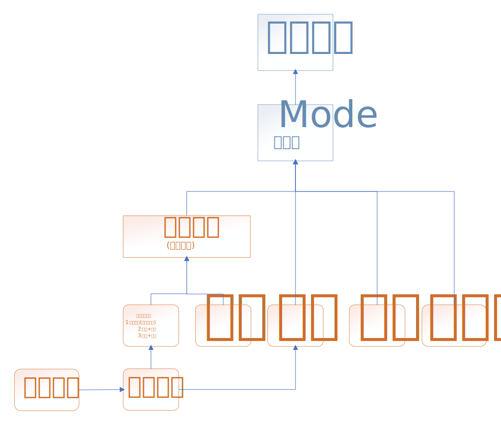

# DLab-Project-Clock

## 基本架構



# 完成清單
- [ ] 時間資訊
- [ ] 時間模式選擇
- [ ] 溫度
- [ ] 顯示模式
- [ ] 鬧鐘
- [ ] 碼表
- [ ] 倒計時
- [*] Mode選擇器  
  

  
 
# Module port

**For example**
```verilog
module(clk, up, down, left, right, seg, show, sound)
    input clk;
    input up;
    input down;
    input left;
    input right;
    output seg[7:0];  //七段顯示器
    output show[7:0];  //七段顯示器的電晶體
    output sound; //聲音
```


    
